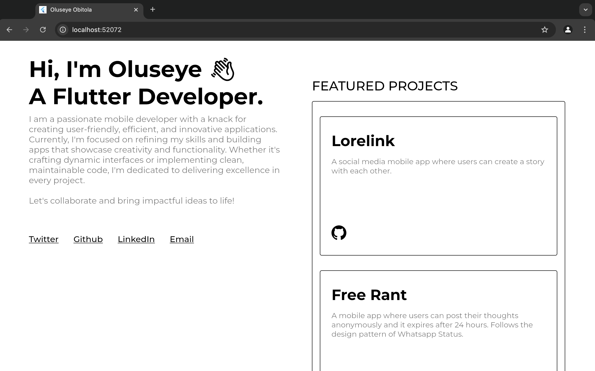
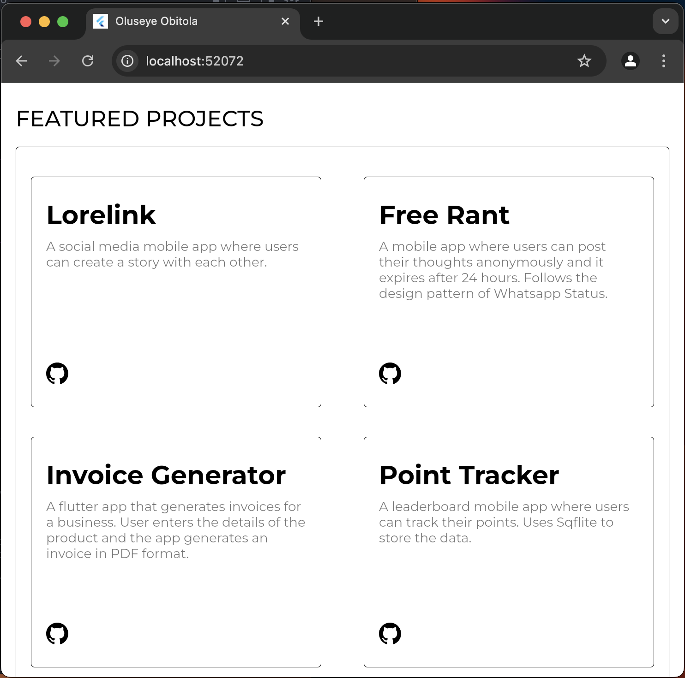
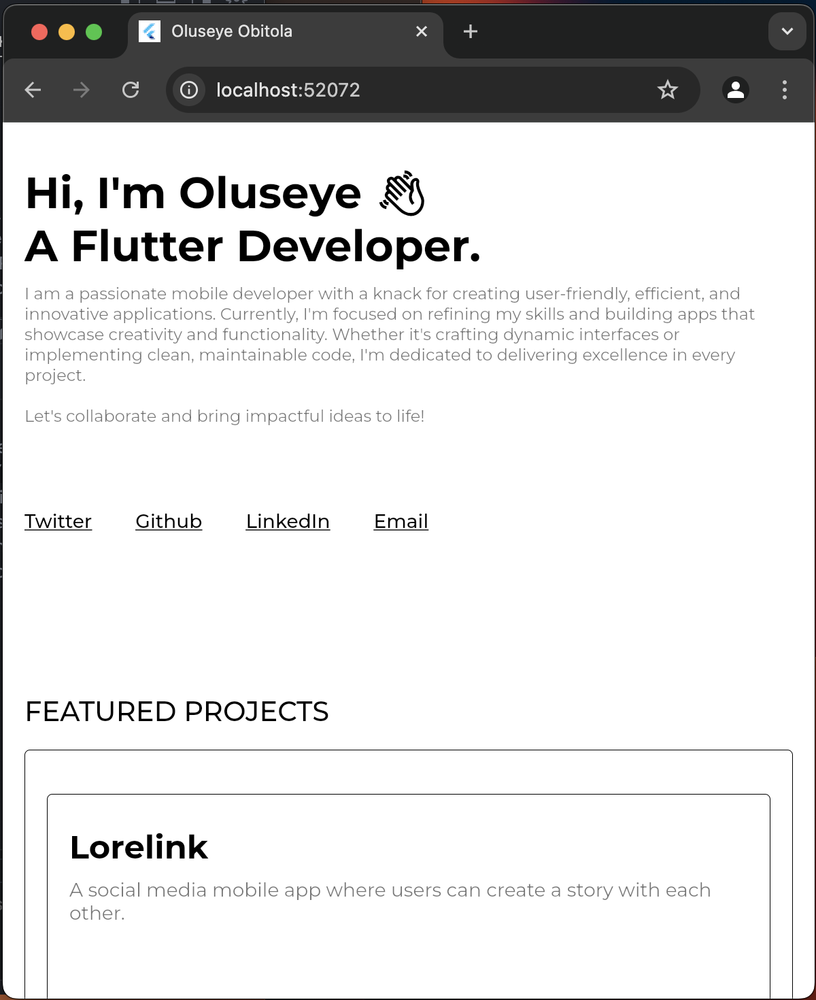

# My Portfolio

A personal portfolio website built with Flutter Web to showcase my projects and articles.

## Features

- Responsive design that works on desktop, tablet and mobile screens
- Project showcase section with links to GitHub repositories
- Articles section featuring my technical blog posts
- Social media links and contact information
- Clean, minimalist design with smooth animations
- Dark mode support with theme toggle

## Technologies Used

- Flutter Web
- Dart
- URL Launcher
- Flutter SVG

## Screenshots

### Desktop View

### Tablet View

### Mobile View

